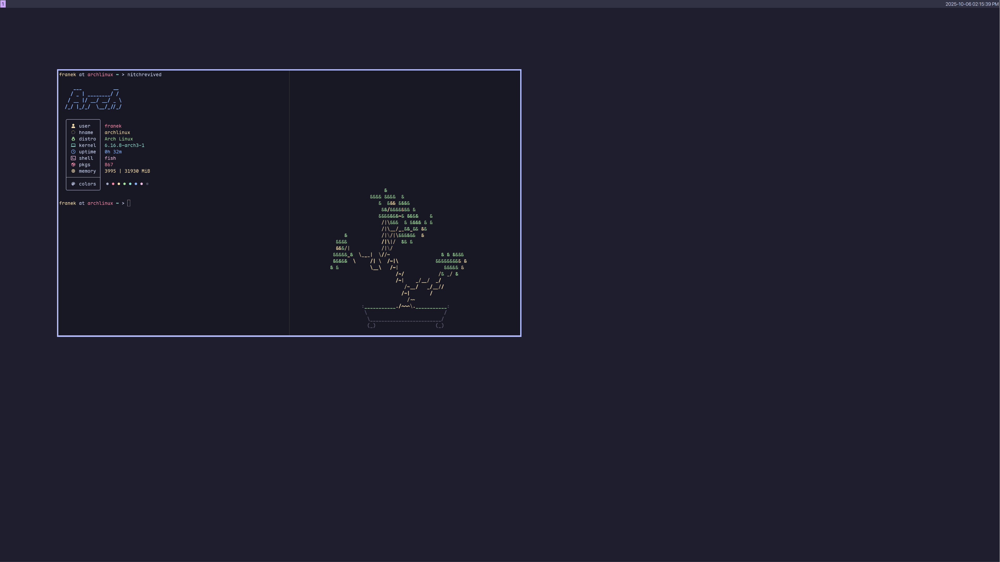
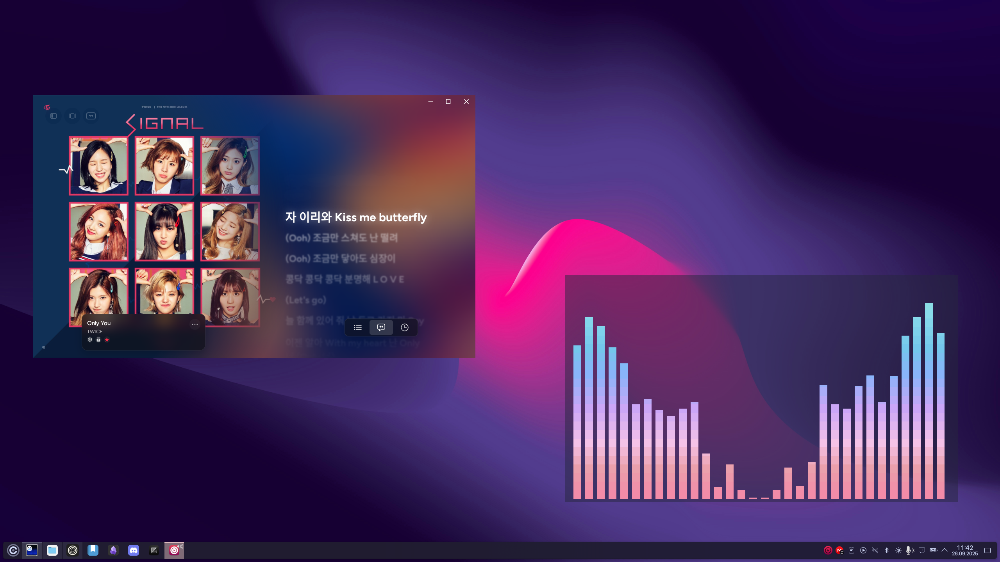
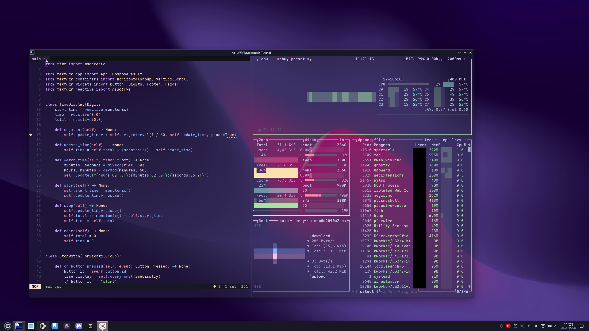
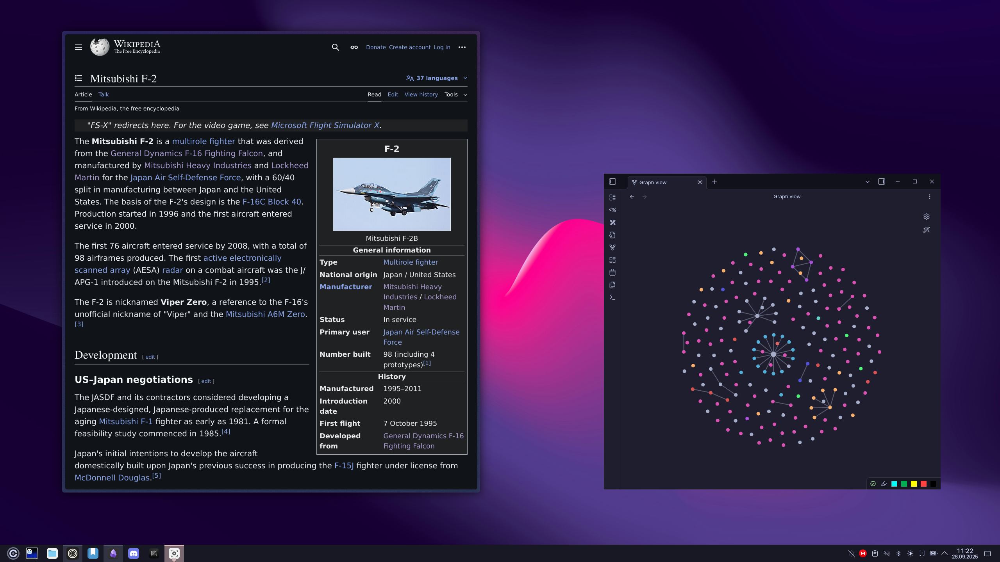
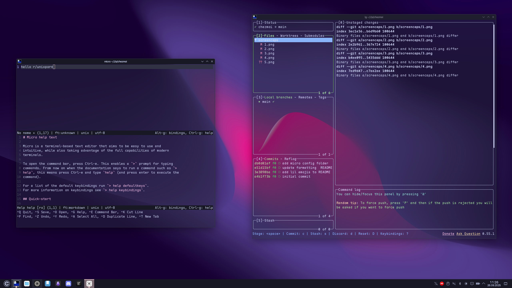

# 🐧LINUX DOTFILES

---

---

## ℹ️ INFO

**OS:** [Arch Linux](https://archlinux.org/)

**DE:** [KDE Plasma](https://kde.org/plasma-desktop//)

**TERMINAL:** [Ghostty](https://ghostty.org/)

**SHELL:** [Fish](https://fishshell.com/)

---

## 💾 SOFTWARE

**DOTFILES MANAGER:** [Chezmoi](https://www.chezmoi.io/)

**TERMINAL EDITOR:** [Helix](https://helix-editor.com/)

**NON-CODING TEXT EDITOR:** [Micro](micro-editor.github.io)

**GUI EDITOR:** [Zed](https://zed.dev/)

**BROWSER:** [Zen](https://zen-browser.app/)

**NOTES:** [Obsidian](https://obsidian.md/)

**TUI MUSIC PLAYER:** [cmus](https://cmus.github.io/)

**GUI MUSIC PLAYER:** [Cider](https://cider.sh/)

---

## 🔣 MISC

**SYSTEM FONT:** 

    - Interface Text: [SF Pro Display](https://developer.apple.com/fonts/)

    - Document Text: [SF Pro Display](https://developer.apple.com/fonts/)

    - Monospace Text: [SF Mono](https://developer.apple.com/fonts/)

**TERMINAL FONT:** [Maple Mono NF](https://github.com/subframe7536/Maple-font)

---

## 🖼️ SCREENSHOTS

Helix + cbonsai

Cider + Cava

Helix + btop

Zen + Obsidian

Micro + Lazygit

